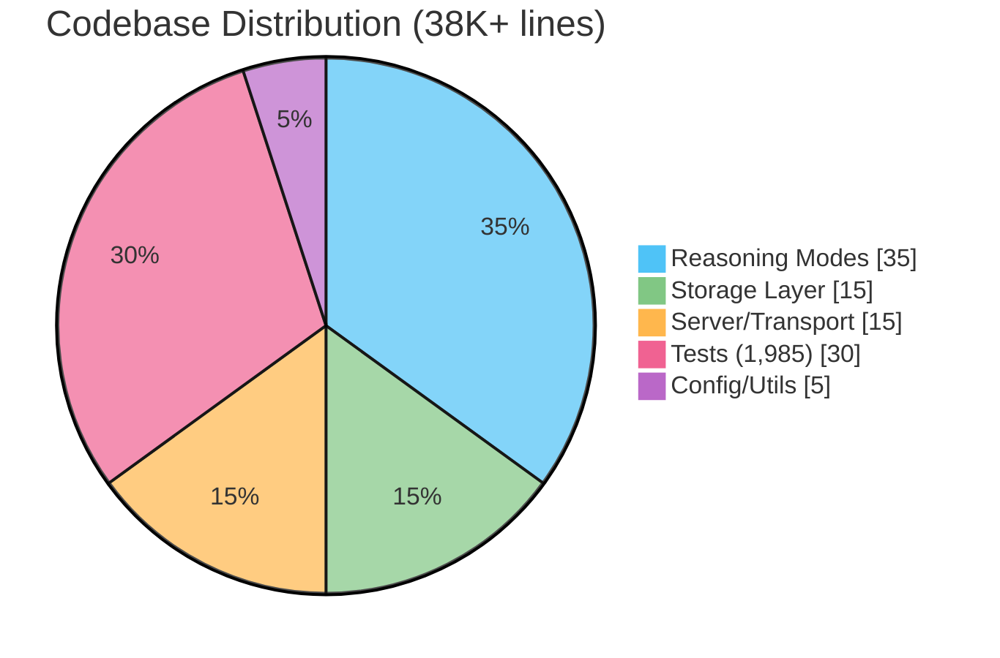
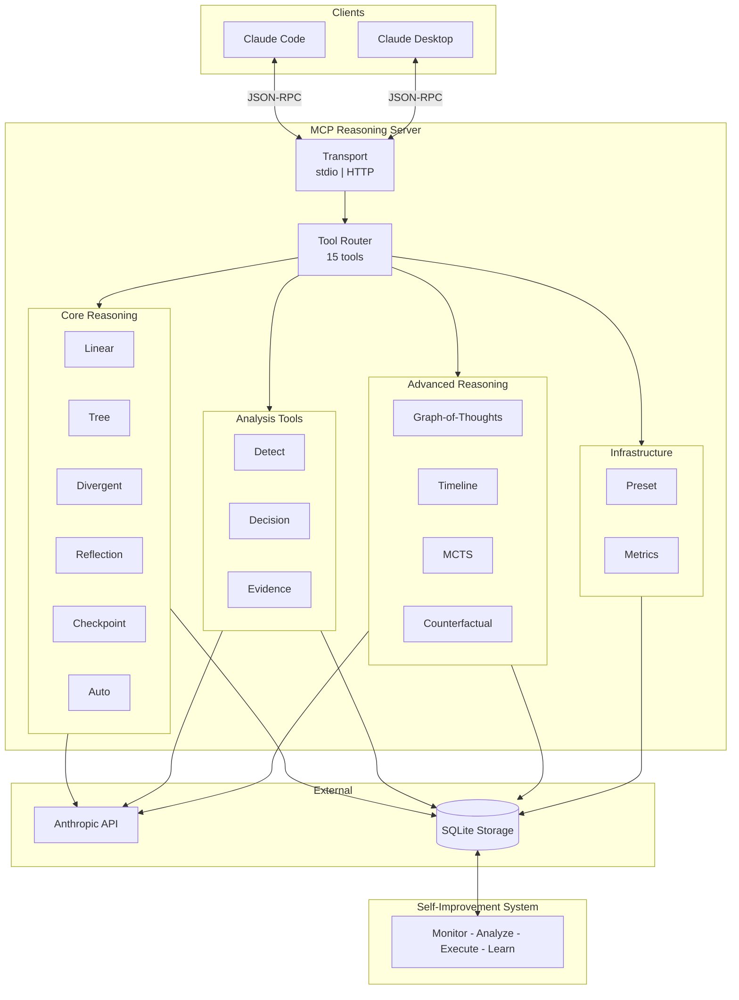
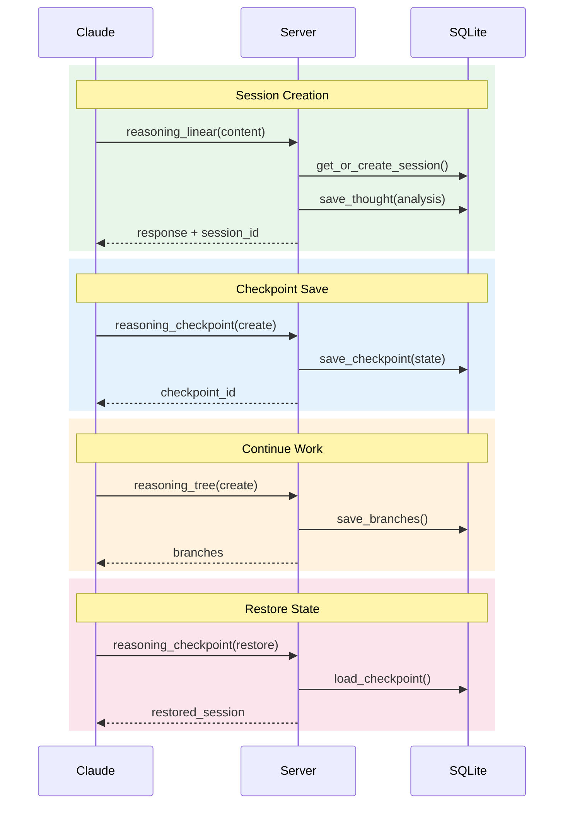
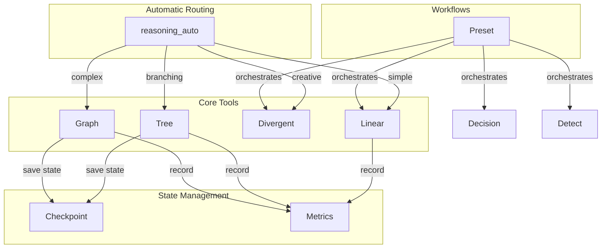
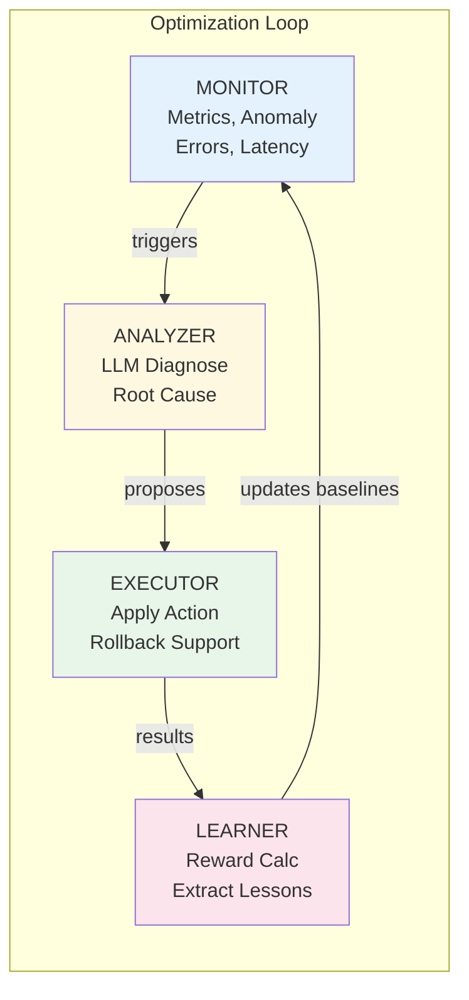
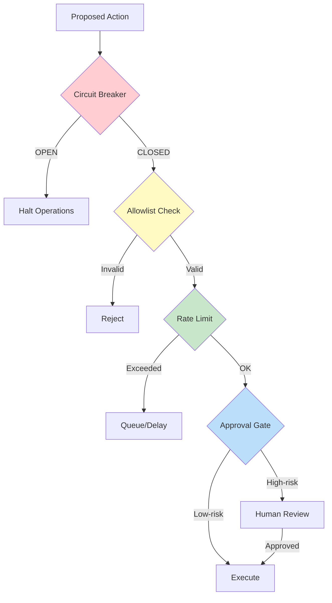

# MCP Reasoning Server

An MCP server providing structured reasoning capabilities for Claude Code and Claude Desktop. Built in Rust with Anthropic API integration.

[](LICENSE)
[](https://www.rust-lang.org/)
[](#development)
[](#development)



## Features

- **15 Structured Reasoning Tools** - Linear, tree-based, graph-based, and advanced reasoning patterns
- **AI Agent Metadata Enrichment** - Rich metadata in all tool responses:
  - **Timeout Prediction** - Duration estimates with confidence levels (Low/Medium/High) to prevent API timeouts
  - **Tool Suggestions** - Context-aware recommendations for next steps (2-5 suggestions per response)
  - **Workflow Discovery** - Relevant preset matching based on tool history and complexity
  - **Historical Learning** - SQLite-backed timing database improves predictions from actual execution data
  - **Complexity Analysis** - Content length, operation depth, and branching factor metrics
- **Decision Analysis** - Weighted scoring, pairwise comparison, TOPSIS, stakeholder mapping
- **Bias & Fallacy Detection** - Identify cognitive biases and logical fallacies with remediation suggestions
- **Counterfactual Analysis** - What-if scenarios using Pearl's causal framework (Ladder of Causation)
- **Monte Carlo Tree Search** - UCB1-guided exploration with auto-backtracking
- **Session Persistence** - Save and restore reasoning state with checkpoints across sessions
- **Built-in Workflow Presets** - Pre-configured workflows for code review, debugging, and architecture decisions
- **Self-Improvement System** - 4-phase optimization loop (Monitor -> Analyze -> Execute -> Learn) with circuit breaker safety
- **Extended Thinking** - Configurable thinking budgets (standard/deep/maximum) for complex reasoning

## Architecture



## Quick Start

### Prerequisites

- **Rust 1.75+** (for async traits)
- **Anthropic API key**

### Installation

```bash
# Clone and build
git clone https://github.com/quanticsoul4772/mcp-reasoning.git
cd mcp-reasoning
cargo build --release

# Binary will be at target/release/mcp-reasoning
```

### Claude Code Integration

```bash
claude mcp add mcp-reasoning \
  --transport stdio \
  --env ANTHROPIC_API_KEY=$ANTHROPIC_API_KEY \
  -- /path/to/mcp-reasoning
```

### Claude Desktop Integration

Add to `claude_desktop_config.json`:

```json
{
  "mcpServers": {
    "mcp-reasoning": {
      "command": "/path/to/mcp-reasoning",
      "env": {
        "ANTHROPIC_API_KEY": "sk-ant-xxx"
      }
    }
  }
}
```

## Configuration

| Variable | Required | Default | Description |
|----------|----------|---------|-------------|
| `ANTHROPIC_API_KEY` | Yes | - | Your Anthropic API key |
| `DATABASE_PATH` | No | `./data/reasoning.db` | SQLite database path |
| `LOG_LEVEL` | No | `info` | Logging level (error/warn/info/debug/trace) |
| `REQUEST_TIMEOUT_MS` | No | `30000` | Request timeout in milliseconds |
| `MAX_RETRIES` | No | `3` | Maximum API retry attempts |

### Session Lifecycle



## The 15 Reasoning Tools

### Core Reasoning (6 tools)

| Tool | Description | Key Operations |
|------|-------------|----------------|
| `reasoning_linear` | Sequential step-by-step reasoning with confidence scoring | Single-pass with next step suggestion |
| `reasoning_tree` | Branching exploration for multi-path analysis | create, focus, list, complete |
| `reasoning_divergent` | Multi-perspective generation with assumption challenges | force_rebellion mode for contrarian views |
| `reasoning_reflection` | Meta-cognitive analysis and iterative refinement | process, evaluate |
| `reasoning_checkpoint` | State management for backtracking | create, list, restore |
| `reasoning_auto` | Mode selection based on content | Automatic routing |

### Graph Reasoning (1 tool)

| Tool | Description | Operations |
|------|-------------|------------|
| `reasoning_graph` | Graph-of-Thoughts for complex reasoning chains | init, generate, score, aggregate, refine, prune, finalize, state |

### Analysis Tools (3 tools)

| Tool | Description | Types |
|------|-------------|-------|
| `reasoning_detect` | Cognitive bias and logical fallacy detection | biases, fallacies |
| `reasoning_decision` | Multi-criteria decision analysis | weighted, pairwise, topsis, perspectives |
| `reasoning_evidence` | Evidence evaluation with Bayesian updates | assess, probabilistic |

### Advanced Reasoning (3 tools)

| Tool | Description | Operations |
|------|-------------|------------|
| `reasoning_timeline` | Temporal reasoning with branching timelines | create, branch, compare, merge |
| `reasoning_mcts` | Monte Carlo Tree Search with UCB1 exploration | explore, auto_backtrack |
| `reasoning_counterfactual` | What-if causal analysis (Pearl's Ladder) | association, intervention, counterfactual |

### Infrastructure (2 tools)

| Tool | Description | Operations |
|------|-------------|------------|
| `reasoning_preset` | Pre-defined reasoning workflows | list, run |
| `reasoning_metrics` | Usage metrics and observability | summary, by_mode, invocations, fallbacks, config |

### Tool Relationships



## Metadata Enrichment for AI Agents

All tool responses include metadata to help AI agents make better decisions about tool usage, timeout management, and workflow composition.

### Metadata Structure

```typescript
interface ResponseMetadata {
  timing: {
    estimated_duration_ms: number;    // Predicted execution time
    confidence: "Low" | "Medium" | "High";  // Prediction confidence
    complexity_score: number;         // 0.0-5.0 complexity metric
    factors: {
      content_length: number;         // Input size
      operation_depth?: number;       // Graph/tree depth
      branching_factor?: number;      // Number of branches
    }
  };
  suggestions: {
    next_tools: string[];             // 2-5 recommended tools
    reasoning: string;                // Why these tools were suggested
  };
  context: {
    tools_used: string[];             // Tools in current session
    preset_recommendations?: string[];// Matching workflow presets
    result_summary: string;           // High-level outcome
  };
}
```

### How It Works

#### 1. Timeout Prediction

The `TimingDatabase` tracks actual execution times and learns from historical data:

- **Cold Start**: Uses baseline estimates from `timing_defaults.rs`
- **Warm**: Averages last 100 executions for the tool + mode combination
- **Adjusts for Complexity**: Multiplies baseline by complexity factors
- **Confidence Levels**:
  - **Low**: < 10 historical samples
  - **Medium**: 10-50 samples
  - **High**: 50+ samples

**Example:**
```json
{
  "estimated_duration_ms": 45000,
  "confidence": "High",
  "complexity_score": 3.2
}
```
→ Agent knows to use 60s timeout tier instead of 30s

#### 2. Tool Suggestions

The `SuggestionEngine` uses rule-based logic to recommend next steps:

- **Context-Aware**: Considers current tool, operation type, and result
- **Ranked**: 2-5 suggestions ordered by relevance
- **Explains Why**: Includes reasoning for each suggestion

**Example after `reasoning_divergent`:**
```json
{
  "next_tools": [
    "reasoning_decision",
    "reasoning_detect", 
    "reasoning_evidence"
  ],
  "reasoning": "Multiple perspectives generated - use decision tool to evaluate options, or detect tool to check for biases"
}
```

#### 3. Workflow Discovery

The `PresetIndex` matches tool history to built-in workflow presets:

- **Pattern Matching**: Compares tools used vs preset requirements
- **Scored**: 0.0-1.0 match score (1.0 = exact match)
- **Contextual**: Considers complexity and operation types

**Example:**
```json
{
  "preset_recommendations": [
    "architecture-decision",
    "strategic-decision"
  ]
}
```
→ Agent discovers the "architecture-decision" preset is relevant

#### 4. Complexity Analysis

Factors that influence duration estimates:

| Factor | Impact | Example |
|--------|--------|---------|
| Content Length | >10k chars = 1.5x | Long documents take longer |
| Operation Depth | >5 levels = 2.0x | Deep graph traversal |
| Branching Factor | >3 branches = 1.5x | Multiple perspectives |
| Thinking Budget | deep/maximum = 2-4x | Extended thinking modes |

### Benefits for AI Agents

1. **Prevent Timeouts**: Choose appropriate timeout tiers before making calls
2. **Optimize Workflows**: Discover multi-tool patterns (presets) instead of one-off calls
3. **Learn Progressively**: Predictions improve with usage (historical learning)
4. **Context Awareness**: Know what tools were used and what comes next
5. **Self-Document**: Result summaries help agents track reasoning chains

---

## Usage Examples

### Linear Reasoning

**Request:**
```json
{
  "tool": "reasoning_linear",
  "arguments": {
    "content": "Analyze the trade-offs between microservices and monolithic architectures",
    "confidence": 0.8
  }
}
```

**Response (with metadata):**
```json
{
  "thought_id": "uuid",
  "session_id": "session123",
  "content": "Step-by-step analysis...",
  "confidence": 0.85,
  "next_step": "Consider decision analysis",
  "metadata": {
    "timing": {
      "estimated_duration_ms": 12000,
      "confidence": "High",
      "complexity_score": 1.5
    },
    "suggestions": {
      "next_tools": ["reasoning_decision", "reasoning_evidence"],
      "reasoning": "Analysis complete - use decision tool to evaluate options"
    },
    "context": {
      "tools_used": ["reasoning_linear"],
      "result_summary": "Trade-off analysis between architectural patterns"
    }
  }
}
```

### Tree Exploration

```json
{
  "tool": "reasoning_tree",
  "arguments": {
    "operation": "create",
    "content": "What are the best approaches to handle user authentication?",
    "num_branches": 3
  }
}
```

### Divergent Perspectives with Force Rebellion

```json
{
  "tool": "reasoning_divergent",
  "arguments": {
    "content": "Should we migrate to a new database technology?",
    "num_perspectives": 4,
    "force_rebellion": true,
    "challenge_assumptions": true
  }
}
```

### Decision Analysis (TOPSIS)

```json
{
  "tool": "reasoning_decision",
  "arguments": {
    "type": "topsis",
    "question": "Which cloud provider should we choose?",
    "options": ["AWS", "GCP", "Azure"],
    "context": "Mid-size startup, ML-heavy workloads"
  }
}
```

### Counterfactual Analysis

```json
{
  "tool": "reasoning_counterfactual",
  "arguments": {
    "scenario": "Our startup chose Python for the backend",
    "intervention": "What if we had chosen Rust instead?",
    "analysis_depth": "counterfactual"
  }
}
```

### Monte Carlo Tree Search

```json
{
  "tool": "reasoning_mcts",
  "arguments": {
    "operation": "explore",
    "content": "Design an optimal caching strategy",
    "iterations": 50,
    "simulation_depth": 5
  }
}
```

## Built-in Presets

| Preset | Category | Description |
|--------|----------|-------------|
| `code-review` | CodeQuality | Analyze code with bias detection and alternative approaches |
| `debug-analysis` | Analysis | Hypothesis-driven debugging with evidence evaluation |
| `architecture-decision` | Decision | Multi-factor architectural decision making |
| `strategic-decision` | Decision | Stakeholder-aware strategic planning with risk assessment |
| `evidence-conclusion` | Research | Evidence-based research synthesis |

Run a preset:

```json
{
  "tool": "reasoning_preset",
  "arguments": {
    "operation": "run",
    "preset_id": "code-review",
    "inputs": {
      "code": "function example() { ... }"
    }
  }
}
```

## Self-Improvement System

The server includes a 4-phase optimization loop with safety mechanisms:

### Optimization Loop



### Safety Mechanisms



**Phase Details:**

| Phase | Function | Key Capabilities |
|-------|----------|------------------|
| **Monitor** | Collect & detect | Metrics aggregation, anomaly detection, error tracking, latency monitoring |
| **Analyzer** | Diagnose & propose | LLM-powered root cause analysis, action proposal generation |
| **Executor** | Apply & protect | Action execution with rollback support, state preservation |
| **Learner** | Extract & improve | Reward calculation, baseline updates, pattern learning |

**Safety Mechanisms:**

| Mechanism | Protection | Trigger |
|-----------|------------|---------|
| **Circuit Breaker** | Halts operations | Consecutive failures exceed threshold |
| **Allowlist** | Validates actions | Every action checked against permitted types/params |
| **Rate Limiting** | Prevents overload | Actions exceed count per time period |
| **Approval Gate** | Human oversight | High-risk actions (optional, configurable) |

## Development

### Build Commands

```bash
# Debug build
cargo build

# Release build (optimized)
cargo build --release

# Run all tests (1,818 tests)
cargo test

# Run specific test module
cargo test modes::linear

# Test metadata module specifically
cargo test metadata::

# Check formatting
cargo fmt --check

# Run clippy lints
cargo clippy -- -D warnings

# Run with coverage (requires cargo-llvm-cov)
cargo llvm-cov
```

### Project Structure

```
src/
├── main.rs              # Entry point (<100 lines)
├── lib.rs               # Module declarations + lints
├── traits.rs            # Core traits (AnthropicClientTrait, StorageTrait)
├── error/               # Unified error types (thiserror)
├── config/              # Configuration + validation
├── anthropic/           # Anthropic API client
│   ├── client.rs        # HTTP client with retry + backoff
│   ├── types.rs         # Request/Response types
│   ├── config.rs        # Model + thinking configuration
│   └── streaming.rs     # SSE stream handling
├── storage/             # SQLite persistence
│   ├── core.rs          # Connection pool + migrations
│   ├── session.rs       # Session CRUD
│   ├── thought.rs       # Thought CRUD
│   ├── branch.rs        # Branch management
│   ├── checkpoint.rs    # Checkpoint storage
│   └── graph.rs         # Graph node/edge storage
├── metadata/            # Response metadata enrichment
│   ├── mod.rs           # Core types (ResponseMetadata, TimingMetadata, etc.)
│   ├── timing.rs        # TimingDatabase with SQLite backend
│   ├── suggestions.rs   # SuggestionEngine for tool recommendations
│   ├── preset_index.rs  # PresetIndex with workflow matching
│   ├── builder.rs       # MetadataBuilder orchestrator
│   └── timing_defaults.rs # Baseline duration estimates
├── prompts/             # Mode-specific prompts
├── modes/               # 13 reasoning mode implementations
│   ├── linear.rs        # Sequential reasoning
│   ├── tree.rs          # Branching exploration
│   ├── divergent.rs     # Multi-perspective
│   ├── graph/           # Graph-of-Thoughts
│   ├── decision/        # Decision analysis
│   ├── detect/          # Bias/fallacy detection
│   ├── evidence/        # Evidence evaluation
│   ├── timeline/        # Temporal reasoning
│   ├── mcts/            # Monte Carlo Tree Search
│   └── counterfactual.rs# Causal analysis
├── server/              # MCP server infrastructure (rmcp)
│   ├── mod.rs           # Server setup & graceful shutdown
│   ├── tools.rs         # 15 tool handlers with metadata
│   ├── types.rs         # AppState with MetadataBuilder
│   ├── responses.rs     # All response types with metadata field
│   └── metadata_builders.rs # Tool-specific metadata builders
├── presets/             # Built-in workflow presets
├── metrics/             # Usage metrics collection
└── self_improvement/    # 4-phase optimization system
    ├── monitor.rs       # Metric collection
    ├── analyzer.rs      # LLM diagnosis
    ├── executor.rs      # Action execution
    ├── learner.rs       # Lesson extraction
    ├── circuit_breaker.rs # Safety mechanism
    └── allowlist.rs     # Action validation
```

### Code Quality Standards

- **Zero unsafe code** - `#![forbid(unsafe_code)]` enforced
- **No panics** - No `.unwrap()` or `.expect()` in production paths
- **1,818 tests** - Unit, integration, and handler tests (95%+ coverage)
- **Max 500 lines per file** - Enforced for maintainability
- **Structured logging** - Via `tracing` crate, logs to stderr
- **Clippy pedantic** - All pedantic lints enabled as warnings
- **Clean release build** - 0 warnings, 0 errors in production builds

### Extended Thinking

The server uses Anthropic's extended thinking feature to allocate additional reasoning budget for complex tasks. Thinking budgets are automatically configured per mode based on task complexity.

#### Thinking Budget Tiers

| Tier | Budget | max_tokens | Modes |
|------|--------|------------|-------|
| **Fast** | None | 4096 | Linear, Tree, Auto, Checkpoint |
| **Standard** | 4,096 tokens | 8,192 | Divergent, Graph (8 operations) |
| **Deep** | 8,192 tokens | 16,384 | Reflection, Decision, Evidence, Detect, Timeline |
| **Maximum** | 16,384 tokens | 32,768 | Counterfactual, MCTS |

#### API Constraints

The Anthropic API enforces two constraints when extended thinking is enabled:

1. **Temperature**: Must be exactly 1 (the server handles this automatically)
2. **max_tokens**: Must be greater than the thinking budget

These constraints are handled automatically by the server - you don't need to configure anything.

## API Reference

- **[Tool Reference](docs/TOOL_REFERENCE.md)** - Complete API documentation for all 15 reasoning tools with parameters, response schemas, and examples
- **[Design Document](docs/DESIGN.md)** - Technical specification and architecture details

## License

MIT

## Contributing

1. Fork the repository
2. Create a feature branch (`git checkout -b feature/amazing-feature`)
3. Ensure all tests pass (`cargo test`)
4. Ensure clippy passes (`cargo clippy -- -D warnings`)
5. Commit your changes (use conventional commits)
6. Submit a pull request

## Acknowledgments

- Built on the [rmcp](https://crates.io/crates/rmcp) MCP SDK
- Inspired by structured reasoning research, Graph-of-Thoughts, and Monte Carlo Tree Search
- Uses Pearl's Ladder of Causation for counterfactual analysis
