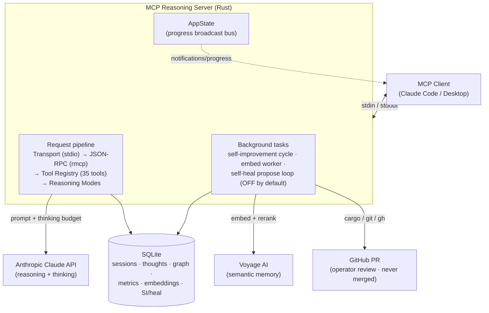
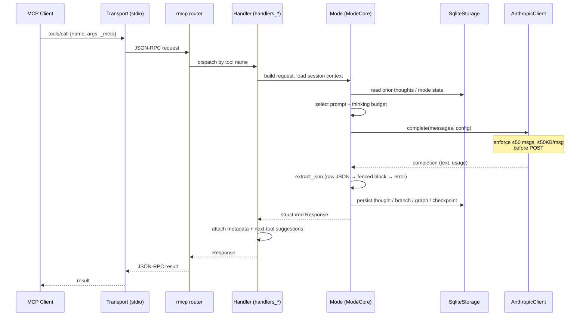
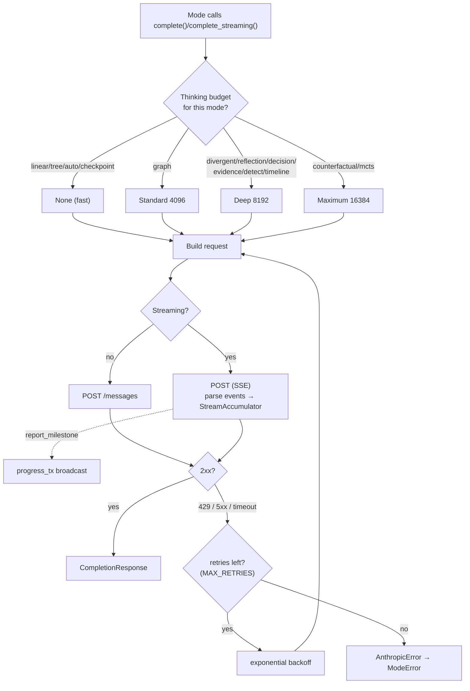
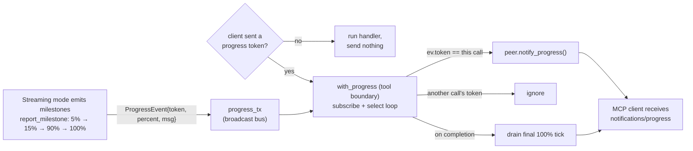
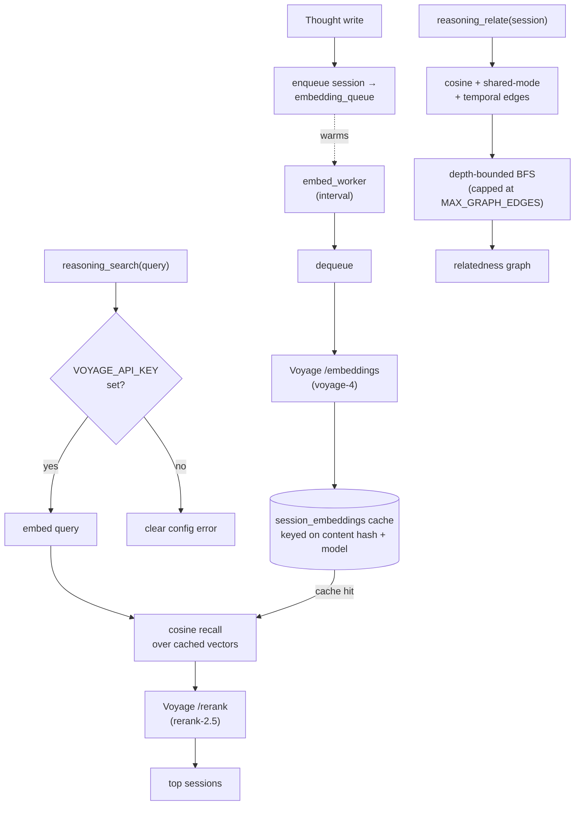
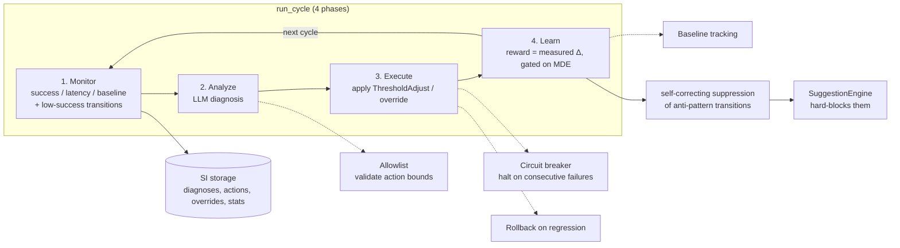
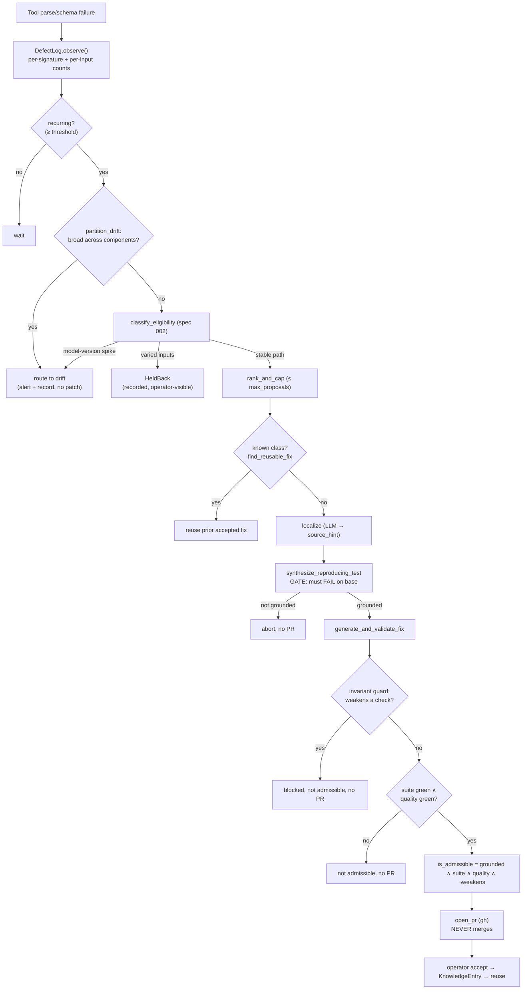
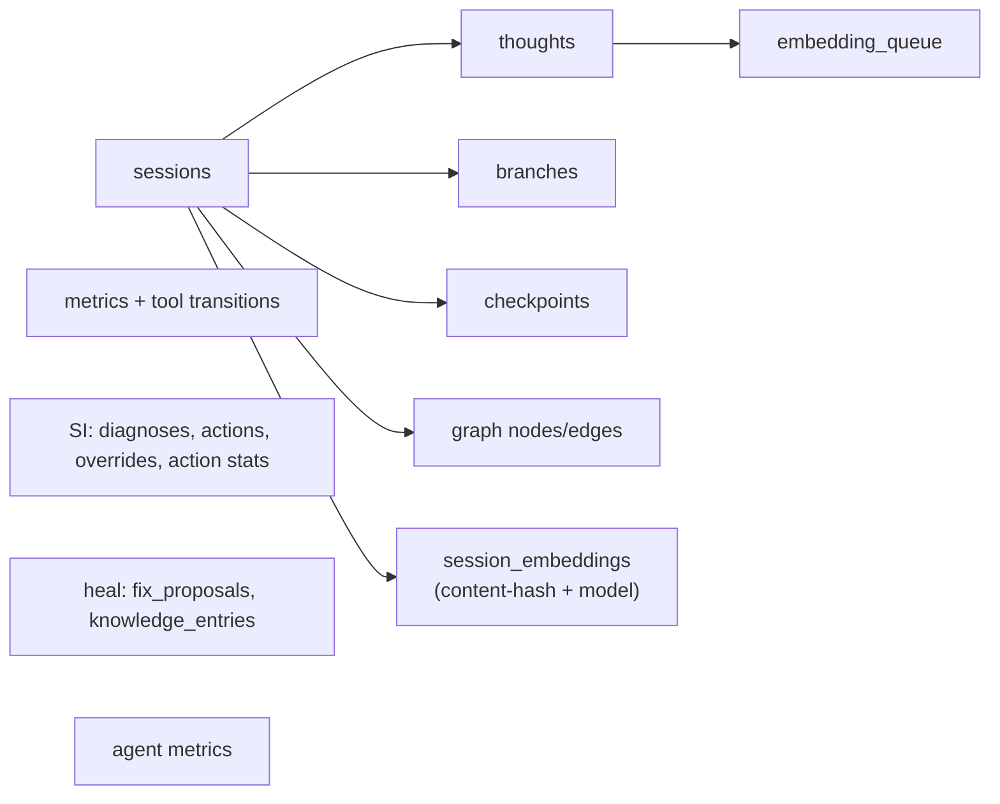

# End-to-End Flow

A detailed, source-grounded map of how a request travels through the MCP
Reasoning Server, and how the two background loops (self-improvement and
self-heal) operate alongside it. Diagrams are [Mermaid](https://mermaid.js.org/)
and render on GitHub.

Contents:

1. [System overview](#1-system-overview)
2. [Tool-call request lifecycle](#2-tool-call-request-lifecycle)
3. [Anthropic client: retry, thinking budgets, streaming](#3-anthropic-client-retry-thinking-budgets-streaming)
4. [Streaming milestone progress over MCP](#4-streaming-milestone-progress-over-mcp)
5. [Semantic memory (Voyage)](#5-semantic-memory-voyage)
6. [Self-improvement loop](#6-self-improvement-loop)
7. [Self-heal propose-PR pipeline](#7-self-heal-propose-pr-pipeline)
8. [Storage / data model](#8-storage--data-model)

---

## 1. System overview

The server speaks MCP over stdio, calls the Anthropic Claude API for reasoning,
optionally calls Voyage AI for semantic memory, and persists everything to
SQLite. Background tasks run on intervals: the self-improvement cycle, the
embedding worker (when Voyage is configured), and — only when explicitly
enabled — the self-heal propose loop.

---

## 2. Tool-call request lifecycle

Every `tools/call` follows the same spine: decode → route → run the mode (which
composes storage + the Anthropic client via `ModeCore`) → extract structured
JSON from the model output → enrich with metadata/next-tool suggestions →
respond. Request-size limits are enforced before any model call.

Key guards on this path:

- **Size limits**, enforced in the Anthropic client just before the POST:
  `MAX_MESSAGES` 50 and `MAX_CONTENT_LENGTH` 50KB/message — rejected before the
  model call.
- **No panics**: production paths never `unwrap()`/`expect()`; failures return a
  typed `ModeError`/`AppError`.
- **JSON extraction** is tolerant: fast path raw JSON → fenced `json` block →
  clear error with a truncated preview.

---

## 3. Anthropic client: retry, thinking budgets, streaming

`AnthropicClient` wraps the HTTP call with bounded retries + backoff, selects an
extended-thinking budget per mode, and can stream Server-Sent Events,
accumulating them into a final response while emitting milestones.

---

## 4. Streaming milestone progress over MCP

Modes emit milestones into a broadcast bus without depending on rmcp. At the tool
boundary, the `progress_bridge` forwards a call's milestones to the client as
`notifications/progress` — but only when the client opted in with a progress
token in the request `_meta`. Each call is correlated by a unique token so
concurrent calls never leak each other's progress.

---

## 5. Semantic memory (Voyage)

`reasoning_search` and `reasoning_relate` (and divergent's novelty scoring)
require `VOYAGE_API_KEY` — there is no keyword fallback. Embeddings are cached in
`session_embeddings`, keyed on a content hash **and** the model. A background
worker warms the cache so the first search/relate after a write is ready.

---

## 6. Self-improvement loop

A 4-phase cycle measures the server's own performance, asks the model to
diagnose regressions, applies bounded parameter changes (or rolls them back), and
rewards measured improvement. Safety mechanisms gate every action.

Operator surface: `reasoning_si_status`, `si_diagnoses`, `si_overrides`,
`si_approve`, `si_reject`, `si_trigger`, `si_rollback`.

---

## 7. Self-heal propose-PR pipeline

The server detects its **own** recurring parse/schema defects and — when
explicitly enabled — opens operator-reviewed PRs that fix them. It **never
merges**. Two spec-002 guards (attribution + the validation-invariant guard) keep
it from acting on noise or weakening a correct check.

Gated by env: `SELF_HEAL_PROPOSE_ENABLED=true` **and** `SELF_HEAL_WORKSPACE` set;
`SELF_HEAL_MAX_PROPOSALS` caps PRs per cycle.

---

## 8. Storage / data model

SQLite is the single source of truth. Caches (`session_embeddings`) are derived
data that self-heal on a miss; the embedding queue decouples writes from Voyage.

---

## Legend

- **Solid arrow** — direct call / data flow.
- **Dotted arrow** — asynchronous / best-effort (milestones, cache hits, safety
  signals).
- **Cylinder** — persistent store. **Diamond** — decision point.

For the component breakdown behind these flows, see
[Architecture](ARCHITECTURE.md); for tool schemas, see
[Tool Reference](TOOL_REFERENCE.md) and [API Specification](API_SPECIFICATION.md).
