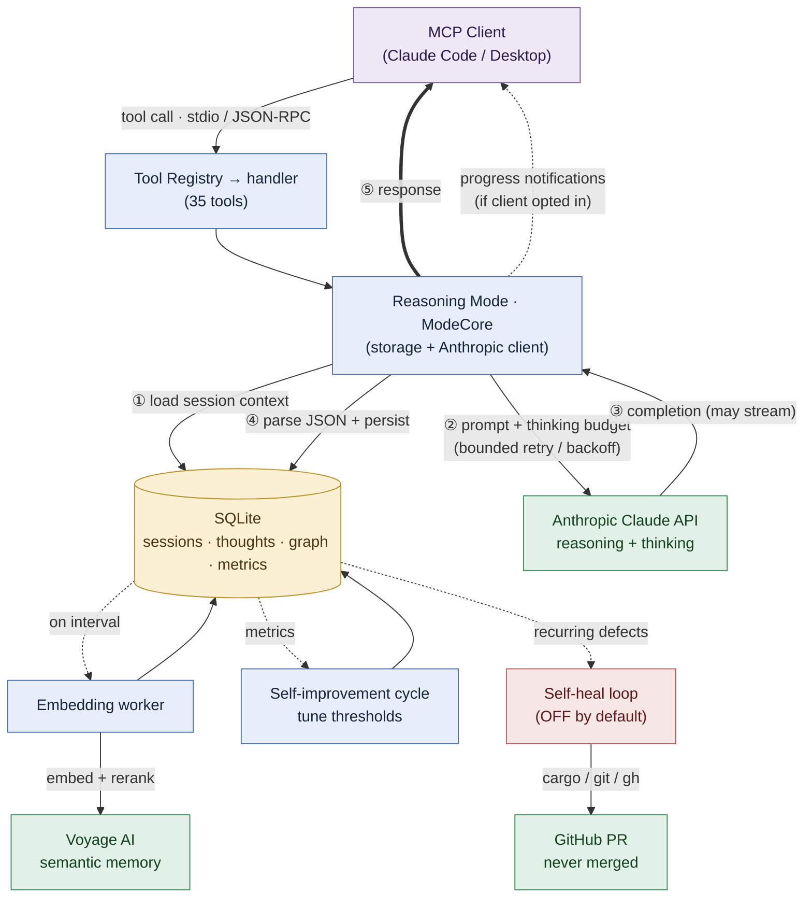

# End-to-End Flow — At a Glance

The whole system in one diagram. A request enters over stdio, runs through a
reasoning mode (which composes storage + the Anthropic client) and returns, while
three background loops keep semantic memory warm, tune the server, and —
optionally — propose fixes for the server's own recurring defects.

For the per-subsystem detail behind each box (the request lifecycle, retry/
thinking budgets, streaming, the 4-phase self-improvement cycle, and the self-heal
decision tree), see **[End-to-End Flow](END_TO_END_FLOW.md)**.

**Reading it:** steps ①–⑤ are the synchronous request spine; dotted edges are
asynchronous (progress notifications, and the interval-driven background loops
that read from SQLite). Colors: 🟦 server process · 🟨 datastore ·
🟩 external service · 🟪 client · 🟥 safety loop (off by default).
