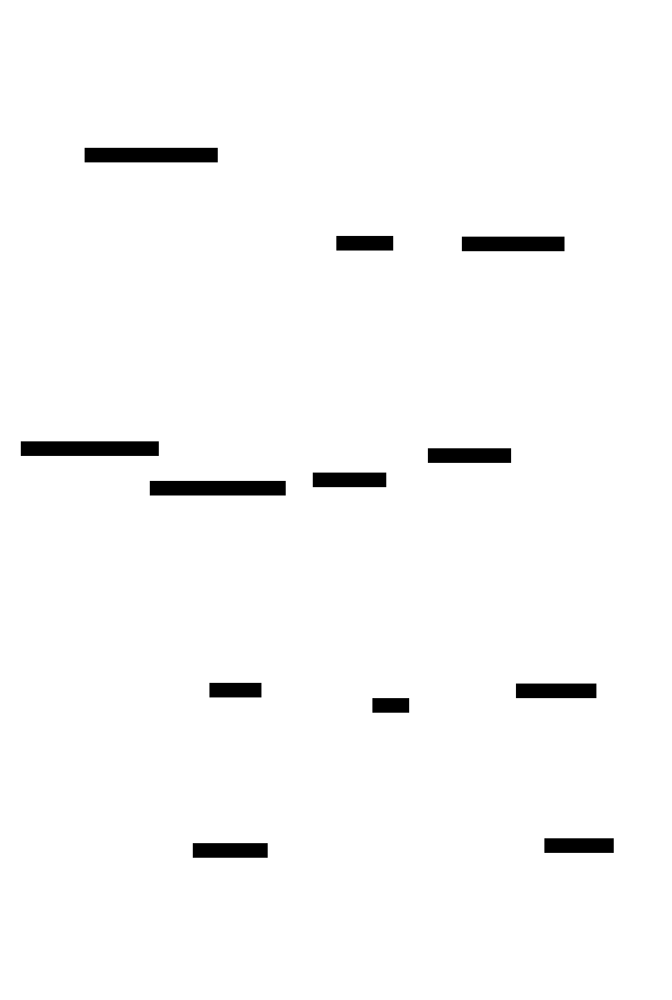

# End-to-End Flow — At a Glance

The whole system in one diagram. A request enters over stdio, runs through a
reasoning mode (which composes storage + the Anthropic client) and returns, while
three background loops keep semantic memory warm, tune the server, and —
optionally — propose fixes for the server's own recurring defects.

For the per-subsystem detail behind each box (the request lifecycle, retry/
thinking budgets, streaming, the 4-phase self-improvement cycle, and the self-heal
decision tree), see **[End-to-End Flow](END_TO_END_FLOW.md)**.

<!-- Rendered from diagrams/flow-overview.d2 with D2 (https://d2lang.com):
     d2 --layout elk --theme 0 --dark-theme 200 --pad 32 \
        docs/reference/diagrams/flow-overview.d2 \
        docs/reference/diagrams/flow-overview.svg
     The SVG embeds a prefers-color-scheme dark variant, so it adapts to
     GitHub light/dark. Edit the .d2 source and re-run the command to regenerate. -->

> The diagram is generated from [`diagrams/flow-overview.d2`](diagrams/flow-overview.d2)
> with [D2](https://d2lang.com) and committed as an SVG that adapts to GitHub's
> light/dark theme. To regenerate after editing the source, run the `d2` command in
> the HTML comment above.

**Reading it:** steps ①–⑤ are the synchronous request spine; dotted edges are
asynchronous (progress notifications, and the interval-driven background loops
that read from SQLite). Colors: 🟦 server process · 🟨 datastore ·
🟩 external service · 🟪 client · 🟥 safety loop (off by default).
